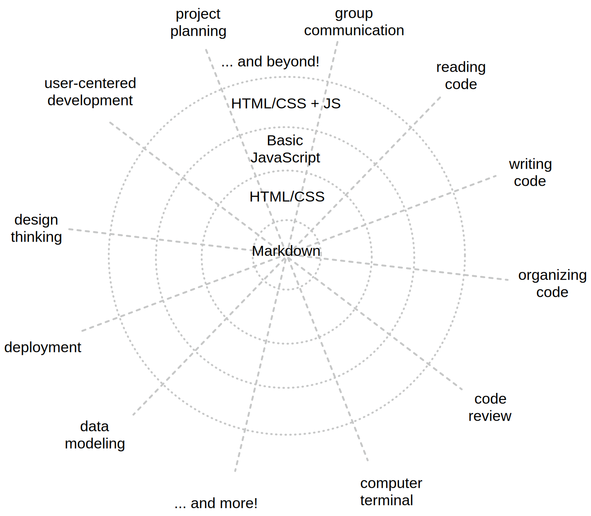

# Guides

Lots of (hopefully) helpful information to help you get the most out of your
time at HYF.

Like you, this document is always improving. If you feel something is missing or
might be improved, please send a _pull request_ or open _an issue_ in your class
repository.

Good luck on your journey to a new future for yourself and your loved ones! 🍀

- [HYF Be Curriculum: a Spider Web](#hyf-be-curriculum-a-spider-web)
- [What is Programming?](#what-is-programming)
- [You are in Control](#you-are-in-control)
- [Collaboration vs. Cheating](#collaboration-vs-cheating)
- [Typical Week](./typical-week.md)
- [Sunday Class](./sunday-class.md)
- [Study Tips](./study-tips/README.md)
  - [Learning from Code](./study-tips/learning-from-code.md)
  - [Self-Assessment](./study-tips/self-assessment.md)
  - [How to Ask Questions](./study-tips/how-to-ask-questions.md)
  - [Study Strategies](./study-tips/study-strategies.md)
  - [HYF Be Materials](./study-tips/hyf-be-materials.md)
- Class Workflows
  - [Asking for Help](./class-workflows/asking-for-help.md)
  - [Check-Ins](./class-workflows/check-ins.md)
  - [Deliverables](./class-workflows/deliverables.md)
  <!-- - [Roll Calls](./class-workflows/roll-calls.md) -->

---

## HYF Be Curriculum: a Spider Web

It's helpful to imagine the HYF Be curriculum as a spider web with two types of
thread:

- **Skills**: The lines going out from the center represent the skills you will
  practice each and every week.
- **Technologies**: The circles going out from the center represent the
  languages and technologies you will learn in each module.

The _Workflows_ modules starts in the center of this spider's web. You will
already be practicing all of the skills but with projects that use only
Markdown. Because Markdown is small and simple you will be free to focus on more
important things like communication and code review.

After you have practiced working on full group projects written in markdown, you
will expand to the second circle with the _Agile Development_ module. This is
when you learn how to collaboratively plan and develop web pages written with
HTML and CSS. You will continue practicing all of the skills you learned in
_Workflows_, only now the programming languages will be more complex.

... and so on, forever! HYF is just the beginning. Your web will continue to
grow after you graduate from HYF as you practice the skills in your web and add
rings of new languages and technologies.

## What is Programming?

Programming is communication. It's also a lot of other things, but this
curriculum will focus on the different ways you communicate with your code.

When you write code you are really just writing a text document, exactly like
you might write an email or a note. The biggest difference between an email and
a computer program is _who you are writing for_.

When you write an email you're writing for the person who will be reading it.
When you write a computer program you are writing for 3 very different audiences
at the same time! One single document (your code) needs to be understandable to:

- **Developers**: A developer needs to read your code and understand what you
  were trying to do and why.
- **Computers**: Your code needs to have _perfect_ syntax so the computer can
  parse it, and you must write instructions that are allowed by the programming
  language or the computer will throw an error.
- **Users**: The instructions you give to the computer must create an intuitive
  and pleasant experience for the user.

Being a developer means understanding how all these characters interact, then
communicating with everyone involved to deliver quality software within your
project's constraints. This diagram shows the different channels of
communication in a software project:

## You are in Control

Throughout your HYF journey and your overall career as a programmer, you will be
responsible for your own learning. 25-30 hours of study is just the minimum we
suggest. The more time you spend and the better you study, the faster you will
find yourself in a job you love. The more you participate and become part of the
HYF community, the more friends you will make, and the more people will want to
help you.

This is not a race against the curriculum or a race against other students. It's
a marathon to a new career, and no one is giving you a rank.

## Collaboration vs. Cheating

Collaborating is encouraged, cheating is not tolerated. There is a large
difference between stealing and collaboration, even if the end result looks the
same (you and another student have the same code). If we find two or more
homework assignments with the same code we will check in with everyone involved
to see if this was collaborative work or cheating:

- **Collaboration** is when you ask each other for help or for explanations, you
  voluntarily share code, and take the time to explain/understand what has been
  shared.
- **Cheating** is when you copy someone’s code to complete the homeworks without
  taking to the time to understand it, without letting them know, or without
  them explaining why they wrote what they did.

At HYF you will not be getting grades on every exercise, so if you cheat you're
only cheating yourself!
