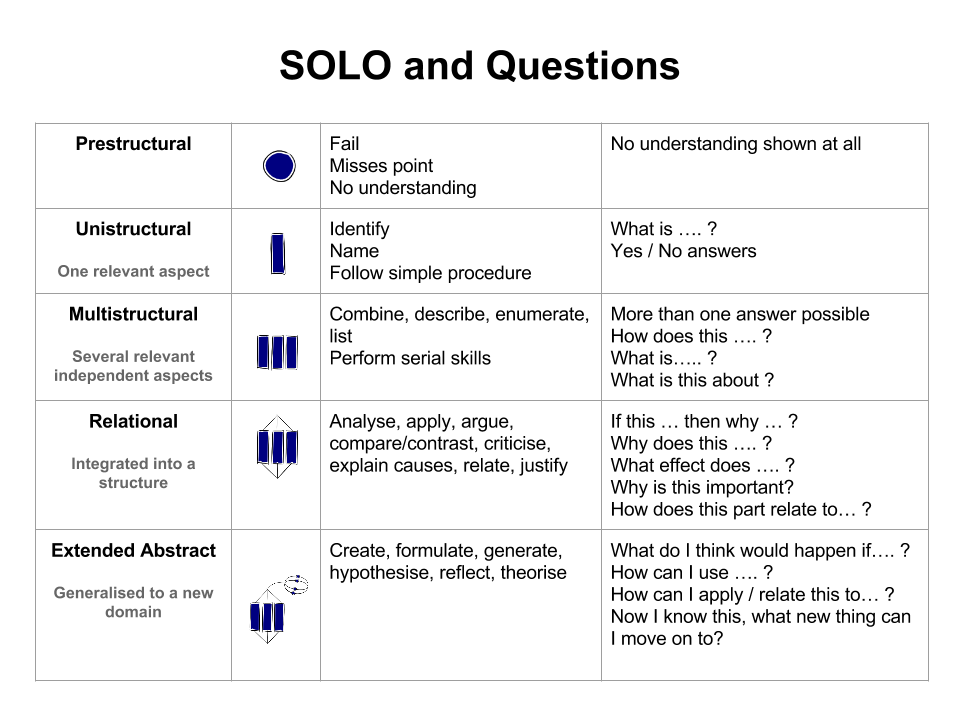
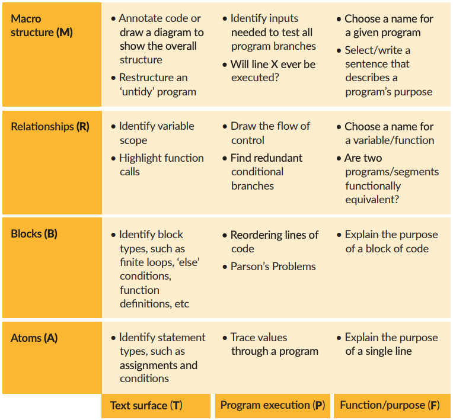

# Self Assessment

Learning to assess your own knowledge and performance are important skills for a
software developer. Here we'll introduce you to a few concepts and techniques
you can use to assess your understanding of JavaScript (and more generally,
software development) as you work your way through this curriculum.

Assessing your own programming skills is naturally hard::

- You're brand new to this, you don't even know what you don't know yet! So how
  can you be expected to assess yourself?
- Programming is very complicated. Knowing where you stand is challenging when
  there are so many different concepts, and all the concepts are related.

You can't expect perfect results, but even trying to self-assess will speed up
your progress by leaps and bounds. You'll learn to notice when you don't
understand something, how to identify & isolate that concept, and how to
redirect your study.

## General Understanding

Web development is complicated: there are many concepts to learn and all of the
concepts are related in different ways. This means you actually have two kinds
of knowledge to build:

- **Concepts**: The individual concepts of web development, things like
  _variables_ and _APIs_ and _repositories_. Studying each of these concepts
  separately will be important before moving on to ...
- **Connections**: How the individual concepts are related, each relationship is
  a new thing to learn! For example once you understand variables and arrays
  separately, you will still need to study _reference vs. value_ (how
  _variables_ store _arrays_ in memory).

A helpful way to assess your own understanding is to use the _SOLO Taxonomy_.
From top to bottom, each row in the table below represents the next step in your
learning. The first levels of the SOLO Taxonomy (_Prestructural_,
_Unistructural_, _Multistructural_) are about understanding **concepts**. The
last levels (_Relational_, _Extended Abstract_) are about understanding and
mastering **connections**.

## Understanding JavaScript Programs

SOLO is good for assessing your overall understanding of web development, but
it's helpful to be more detailed when it comes to checking how well you
understand a specific file or program written in JavaScript.

The
[**Block Model**](https://helloworld.raspberrypi.org/articles/hw14-the-i-in-primm)
breaks down the vague idea of "understanding a program" into specific skills
along 2 dimensions:

- **Zoomed In -> Zoomed Out**: Focusing first on each detail, then build up to a
  high-level understanding of the entire program:
  1. _Atoms_
  2. _Blocks_
  3. _Relationships_
  4. _Macro Structure_
- **Depth of Understanding**: Focusing first on the code as a text, then
  building up to it's purpose in the world:
  1. _Text Surface_
  2. _Program Execution_
  3. _Purpose and Context_

The image below shows the Block Model in a table with examples of things you can
do to check your understanding at each level.

## References

- SOLO Taxonomy
  - [Great intro video](https://www.youtube.com/watch?v=_ZoIPXJ8XRQ)
  - [Intro: Future Learn](https://www.futurelearn.com/courses/learning-teaching-university/0/steps/26410)
  - [Intro: Hooked on Thinking](http://www.pamhook.com/mediawiki/images/b/b2/SOLO_Taxonomy%2C_Scratch_and_Angles_in_Geometry.pdf)
  - [Self-assessment template](http://pamhook.com/mediawiki/images/e/ee/SOLO_Functioning_Knowledge_Rubric_Template.pdf)
  - [Example self-assessment for loops](http://pamhook.com/mediawiki/images/1/10/HookED_Writing_Code_Rubric.pdf)
- Block Model
  - [Sue Sentance](https://helloworld.raspberrypi.org/articles/hw14-the-i-in-primm)
  - [teachcomputing.org](https://blog.teachcomputing.org/quick-read-understanding-program-comprehension-using-the-block-model/)
  - [Raspberry Pi Quick Read](https://raspberrypi-education.s3-eu-west-1.amazonaws.com/Quick+Reads/Pedagogy+Quick+Read+12+-+Block+Model.pdf)
