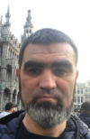
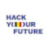

# My Bio

## Ervin Mamutov

---

### Education 👨‍🎓

Master

- **_Taurida National University_**, Simferopol - business information systems,
  cybernetic
- **_Crimea State University_**, Simferopol - engineer, radio-physicist and
  electronics

#### Relevant courses 🧑‍🎓

- [JavaScript (sololearn.com)](https://www.sololearn.com/certificates/CT-ZCOWQXGB)
- [CSS (sololearn.com)](https://www.sololearn.com/certificates/CT-YHIGVYC2)
- [HTML (sololearn.com)](https://www.sololearn.com/certificates/CT-SXOMP92W)
- [Wev Design (freecodecamp.org)](https://www.freecodecamp.org/fcc182bc0c3-5bb8-47cf-a377-2576cebcb2d0)

#### **Now** I’m on a **_teach_** at the **_HackYourFuture Belgium_**

### My **hobbies** 👍

- New **technologies** 🤖
- Reading the **books** 📖
- **Computers** 💻
- **Walk** in nature🚶
- **Basketball** 🏀⛹️‍♂️

---

### Languages💬

- **_ukraine_**
- **_russian_**
- **_turk_**
- **_english_**
- **_french_**

---

### My github ⌨️

[Ervin Mamutov](https://github.com/ervinMamutov)

---
